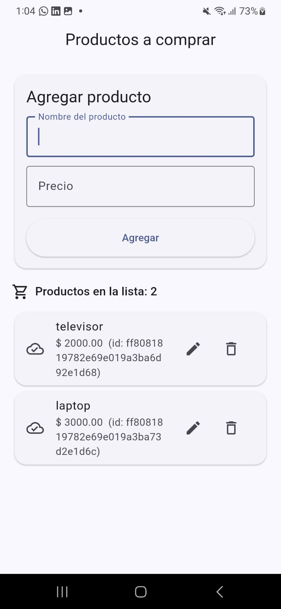
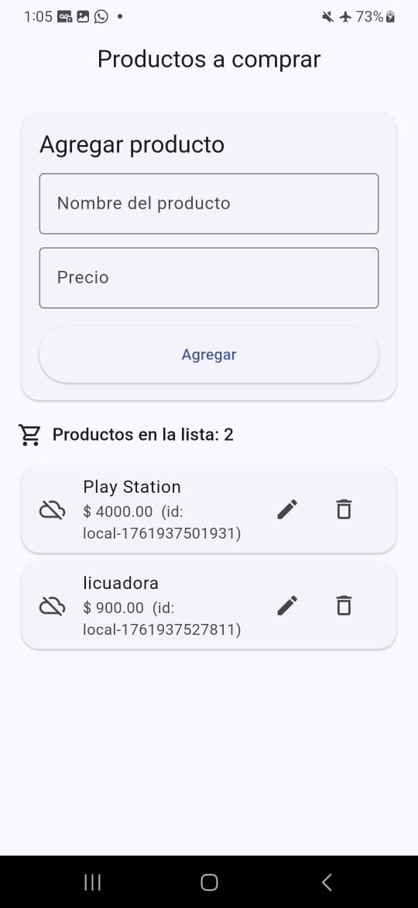

# 🛒 Prueba Técnica Flutter - Gestión de Productos

Aplicación móvil desarrollada con **Flutter** para la gestión de productos, integrando una **REST API pública** y **persistencia local** mediante **SQLite**.

---

## 📱 Descripción general

Esta aplicación permite:
- Agregar, editar y eliminar productos.
- Guardar los productos localmente en una base de datos SQLite.
- Sincronizar con la API pública [restful-api.dev](https://restful-api.dev).
- Funcionar sin conexión (modo offline) y mostrar el estado con íconos de nube.

---

## ⚙️ Tecnologías utilizadas

- **Flutter 3.35.7**
- **Dart 3**
- **Material Design 3**
- **HTTP** – conexión REST.
- **Sqflite** – persistencia local.
- **Path** – manejo de rutas de base de datos.

---

## 🧠 Decisiones de implementación

- Se usó un **patrón Repository** para separar la lógica de red y almacenamiento local.  
- `RestApiService` maneja las llamadas HTTP a `restful-api.dev`.  
- `LocalDb` usa SQLite para persistir productos sin conexión.  
- `ProductRepository` coordina la sincronización nube ↔ local y el manejo del modo offline.  
- El modelo `Product` maneja los formatos JSON tanto para API como para SQLite.  
- El diseño de la UI sigue **Material Design**, con formularios, cards y SnackBars informativos.

---

## 🎨 Interfaz

| Sección | Descripción |
|----------|--------------|
| Formulario superior | Campos para nombre y precio del producto. |
| Lista inferior | Cards de productos con íconos de sincronización. |
| ☁️✅ | Producto sincronizado con la API. |
| ☁️❌ | Producto guardado localmente sin conexión. |

---

## 📸 Capturas de pantalla

### Modo online

### Modo offline

*(Guarda tus imágenes en la carpeta `/screenshots` del repositorio)*

---

## 🎬 Video demostrativo

📹 [Ver video en Google Drive]([https://drive.google.com/](https://drive.google.com/file/d/1OR30ER4atFwOg7EQRDmh9g1kKlWXIQT8/view?usp=drive_link)

El video muestra:
1. Agregar productos online.  
2. Agregar productos offline (modo avión).  
3. Íconos de nube según estado.  
4. Re-sincronización automática al volver la conexión.

---

## 👨‍💻 Autor

**Jonathan David Cáceres**  
Proyecto desarrollado como parte de la prueba técnica Flutter 2025.
